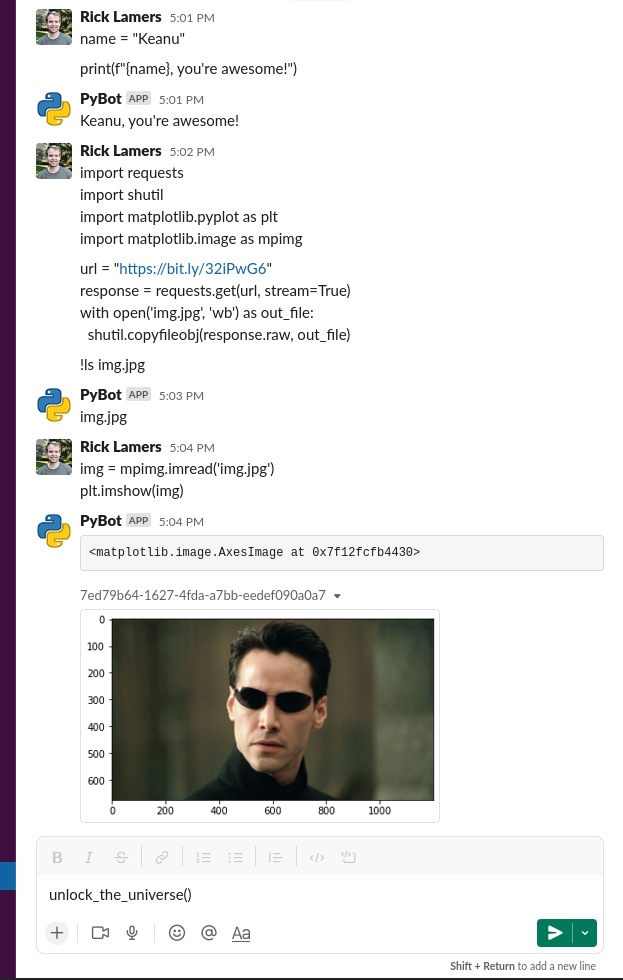

# Slack IPython bot 🤯

One Slack bot to rule them all. PyBot. Just send Python code as a message.



## Install

```pip install slack-ipython```

To start the bot, simply run: 

```slack-ipython```

For detailed output, add `DEBUG=true` as an environment variable.

Create a `.env` (or set these environment variables yourself).

```
SLACK_APP_TOKEN="xapp-..."
SLACK_BOT_TOKEN="xoxb-..."
```

## Configure your Slack app
First create a new Slack app in the Slack [app dashboard](https://api.slack.com/apps/).

Your Slack app needs to have:
- [Settings -> Basic Information -> App-Level Tokens]
    - Create a bot token
        - connections:write
    - (Optional) configure [app icon](assets/images/python-logo.png).
- [Settings -> Socket Mode]
    - Socket mode enabled
- [Features -> App Home]
    - Messages Tab enabled
- [Features -> App Home -> Show Tabs]
    - "Allow users to send Slash commands and messages from the messages tab" enabled
- [Features -> OAuth & Permissions -> Scopes]
    - The following OAuth scopes
        - chat:write
        - files:write
        - im:history
        - im:read
        - im:write
- [Features -> Event Subscriptions]
    - Events enabled
    - Subscribed to bot events
        - message.im

Or use the App Manifest [slack_app.yaml](slack_app.yaml).

Make sure you install the Slack app in your workspace after configuring the above.
